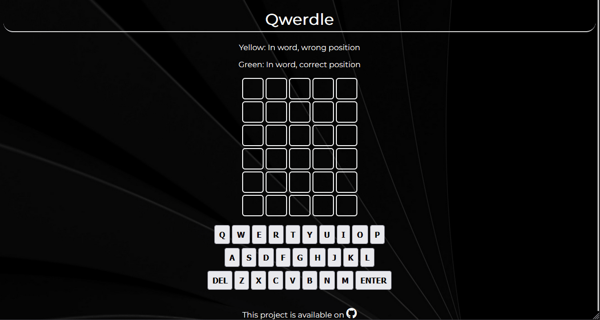

    
    </a>

<h2 align="center">Tech</h2>

    
    
    
    
    
    
    
    
    
    
    
    
    
    
    
    
    
    
    
    

---

  
  
  
<!--    -->

*   🖥️  Portfolio: [ryanshort.netlify.app](http://ryanshort.netlify.app)
*   ✉️  Contact: [ryanshort.webdev@gmail.com](mailto:ryanshort.webdev@gmail.com)

<h2 align="center">Recent Projects</h2>
<table bordercolor="#66b2b2">
  
  <tr>
    <td width="50%" valign="top">
      <h3 align="center">Brieje Salon</h3>
         
        
         
        

          
    
  
      

        
<strong>Javascript, Express, Node.js CSS, SCSS, HTML</strong> - A site built for a classy salon, located in Historic Downtown Gatlinburg, TN

    </td>
    <td width="50%" valign="top">
      <h3 align="center">L.A. Star Gazers</h3>
         
      
         
        

          
  
  
      

        
<strong>Javascript, Express, Node.js CSS, SCSS, HTML</strong> - Site made for a small L.A. based astronomy community

    </td>
  </tr>
  
  <tr>
    <td width="50%" valign="top">
      <h3 align="center">The Unofficial DBZ API</h3>
       
        
       
        

  
  
      

        
<strong>HTML, CSS, JavaScript, Node.js, Express.js</strong> - This is a simple API that sends DBZ character data to client devices

    </td>
    <td width="50%" valign="top">
      <h3 align="center">Qwerdle</h3>
         
        
         
        

          
  
  
      

        
<strong>HTML5, CSS3, & Javascript</strong> - A fun remake of the popular game 'Wordle'

    </td>
  </tr>
</table>
